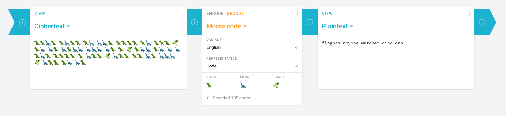

# Dino Dino Pickle

### Basic Info

 🦖🦖🦕🦖 🦖🦕🦖🦖 🦖🦕 🦕🦕🦖 { 🦖🦖🦖🦖 🦖🦕 🦖🦖🦖 🥒 🦖🦕 🦕🦖 🦕🦖🦕🦕 🦕🦕🦕 🦕🦖 🦖 🥒 🦖🦕🦕 🦖🦕 🦕 🦕🦖🦕🦖 🦖🦖🦖🦖 🦖 🦕🦖🦖 🥒 🦕🦖🦖 🦖🦖 🦕🦖 🦕🦕🦕 🥒 🦕🦖🦖 🦖🦕 🦕🦖 }

#### Hint
 >long neck, short arms, space pickle (blink blink)

### The Breakdown

Long-Short-Long-Long-Short hmmm sound familiar? If not this is the classic Morse Code challenge just with dinos.

Albeit hard to see there are spaces between the letters but if you just use Cryptii to decode it...

### Solution
flag{has anyone watched dino dan}