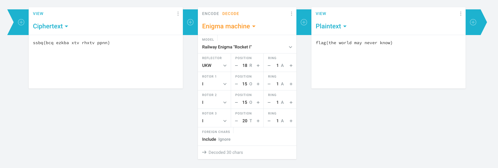

# Winning a CTF

### Basic Info

How many times does it take to win a CTF? ssbq{bcq ezkba xtv rhxtv ppnn}

#### Hint
> Rocket: Hmm it sure is an enigma, what's your position on this Root? Root: I am ROOT

### The Breakdown

If you look at the hint, all the information is there if you interpret it right.

Ever hear of an Enigma cipher? Well it was a popular cipher used in both World Wars and there were different machines built to encrypt/decrypt certain messages.

One such machine is called a Railway Engima aka "Rocket 1"

If you go here:
https://cryptii.com/pipes/enigma-machine

Plug in ROOT as your position...

### Solution
flag{the world may never know}
*oops forgot to do the underscores*