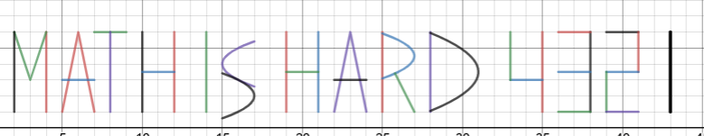

# Left Right & Numbers

### Basic Info
Like my dance I call it the "Left Right Shuffle" 

*note not in flag format*

```
x\ =4\left\{1<y<6\right\}
y=\left|3x-9\right|\ +3\ \left\{2<x<4\right\}
x\ =2\ \left\{1<y<6\right\}
y=-\left|5x-30\right|\ +6\ \left\{y>1\ \right\}
y=3\ \left\{5<x<7\right\}
y\ =\ 6\ \left\{7<x<9\right\}
x=8\ \left\{1<y<6\right\}
x=10\ \left\{1<y<6\right\}
x=12\left\{1<y<6\right\}
y=3.5\left\{10<x<12\right\}
x\ =\ 14\ \ \left\{1<y<6\right\}
x=\left(y-4\right)^{2}\ +15\ \left\{x<17\right\}
x=-\left(y-2\right)^{2}\ +17.\ \left\{x>15\right\}
x=19\left\{1<y<6\right\}
x=21\left\{1<y<6\right\}
y=3.5\left\{19<x<21\right\}
y=-\left|5x-115\right|\ +6\ \left\{y>1\ \right\}
y=3\left\{22<x<24\right\}
x=25\ \left\{1<y<6\right\}
x=-\left(y-4.5\right)^{2}\ +27\ \left\{x>25\right\}
y=-2x+55\ \left\{1<y<3.404\right\}
x=28\ \left\{1<y<6\right\}
x=-\frac{1}{2}\left(y-3.5\right)^{2}\ +31\left\{x>28\right\}
x=35\left\{1<y<6\right\}
y=3\left\{33<x<35\right\}
x=33\left\{3<y<6\right\}
x\ =\ 38\ \left\{1<y<6\right\}
y\ =\ 6\ \left\{36<x<38\right\}
y\ =\ 3.5\ \left\{36<x<38\right\}
y\ =\ 1\left\{36<x<38\right\}
y\ =6\ \left\{39<x<41\right\}
x=41\ \left\{3.5<y<6\right\}
y=3.5\ \left\{39<x<41\right\}
x=39\ \left\{1<y<3.5\right\}
y=1\ \left\{39<x<41\right\}
x=43\ \left\{1<y<6\right\}
```

#### Hint
> Calculators are allowed

### The Breakdown

Ew gross that is a lot of junk that I am not reading again. Trust me this one took a while, probably not as bad as *If Lop* but at least an hour.

If anyone has ever used the popular graphing tool *Desmos* then you'll know that copy and pasting piece-wise functions looks a lot like this…

Putting it into *Desmos* spits out



### Solution
math is hard 4321
*apologizes for the formatting stuff*