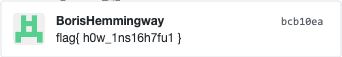

# Archaeology

### Basic Info
There is a flag hidden somewhere in the past

### The Breakdown

For those of you that have used GitHub this may have been obvious but for those who have not here we go!

So when we first click on the link we are greeted to this page

*Note the highlighted bit*

In GitHub the commit log tell you how many times the file has been altered and changed in the past by the owner of the repository.

This is **super** suspicious with the challenge title dubbed "Archaeology"

So to check all the commits in all the branchs we go to the <ins>Insights</ins> tab, the Network Graph

Looking over the various points we find this:

**Enhance!**

### Solution
> flag{ h0w_1ns16h7fu1 }