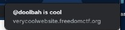
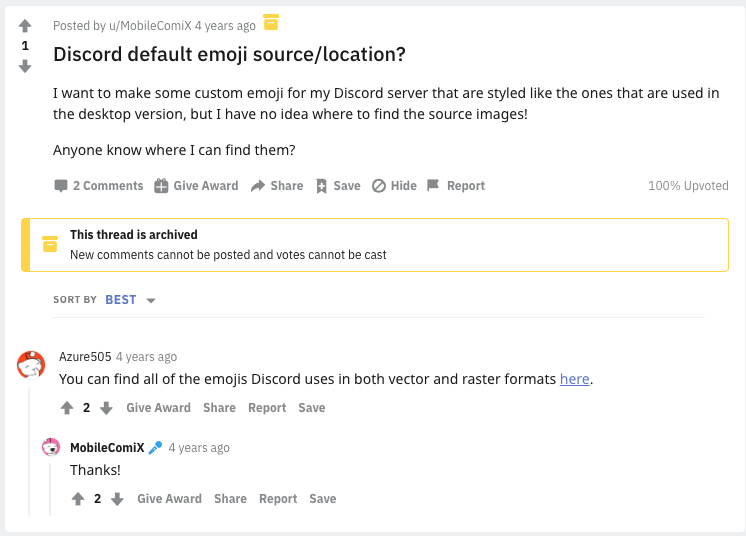

# Developer Hunt

### Basic Info
Who created the verycoolwebsite?

*note: Many of the recon challenges will not be in flag format*

*note 2: This is the developer mentioned in the rest of the recon challenges*

#### Hint 1: 
 > Did you check the website top to bottom? 

#### Hint 2: 
> Ever wonder where the default Discord emojis come from 🤔?

### The Breakdown

The question here is referring to this website ([verycoolwebsite](https://verycoolwebsite.freedomctf.org/)) which was in reference to a previous challenge *Sloppy Auth* which featured a client side secured flag.

When looking at the website something should immediately tell you that something is off. 

The title of the actual website does not match the "verycoolwebsite" title.

This shouldve sent many questions into your head like: "what is doolbah?", "who is doolbah?", etc, etc.

Perhaps this wasnt super obvious but only a couple of the big social media sites use the *@* symbol to call reference to a user.  

**Twitter** and **Instagram**  

Since the second hint asks us where Discord emojis come from, a quick Google search gives us:

This links us here: [twemoji](https://github.com/twitter/twemoji) and we know it is Twitter.

To get around logging in we just input our boy ***@doolbah*** into the search box like so: https://twitter.com/doolbah and we got our guy.

Hint 1: Was referencing the title of the website in the header tag and the footer as the bottom, once you looked at the title you had to do some Googling

Hint 2: Explained with Twemoji

Common Errors: 
* Trying to straight up Google @doolbah. Sorry guys we dont have that much clout
* Trying to plug in the flag to Sloppy Auth, yea there was another secret :P

### Solution:
> doolbaHnitneuQ
