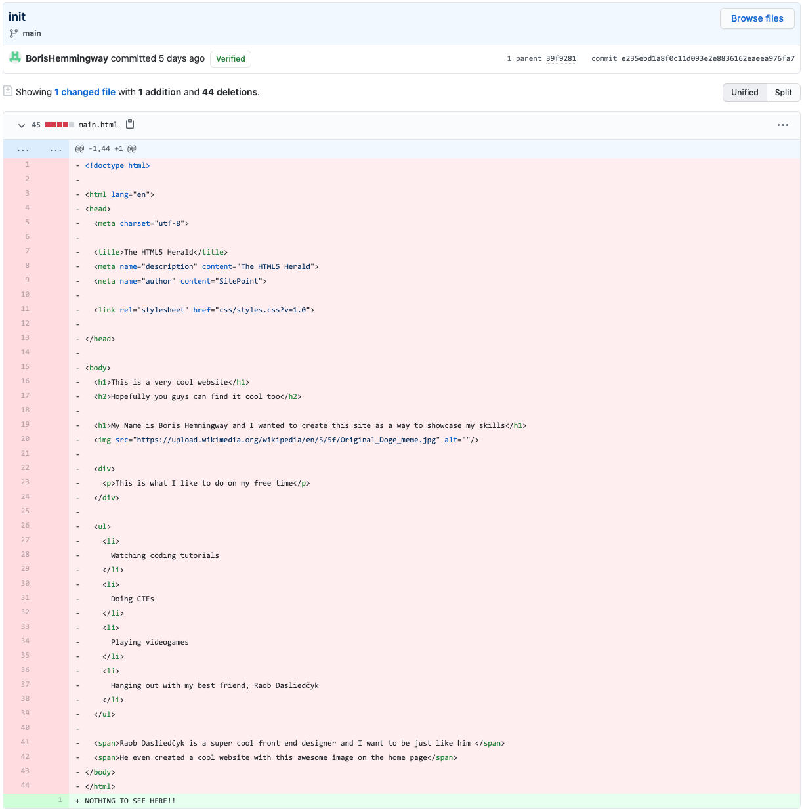
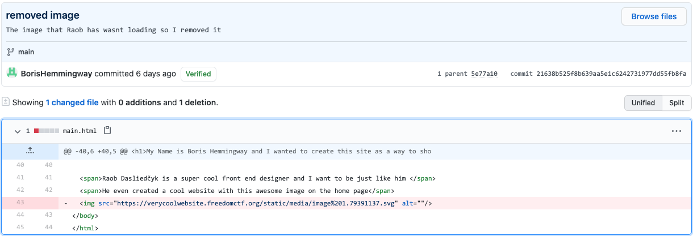

# Don't Plagarize

### Basic Info

Apparently the website wasn’t even created by this developer :O who made it??

*not in flag format*

### The Breakdown

If you got the previous Archaeology challenge then you have already a masted the art of time travel.

Using this great power, all we do is hop back in time on the main branch commit dubbed "init"

We see that Boris' best friend is Raob Dasliedčyk and he is a "cool front end designer" but did he create the website?

Going one more back to "removed image" gives us this

Confirming that Raob Dasliedčyk did in fact create the website because Boris took the image from the home page and tried implementing it himself  
*(side note: you can also tell that Boris does not know what he doing based off of the boiler plate code and random copied and pasted css)*

### Solution
Raob Dasliedčyk

