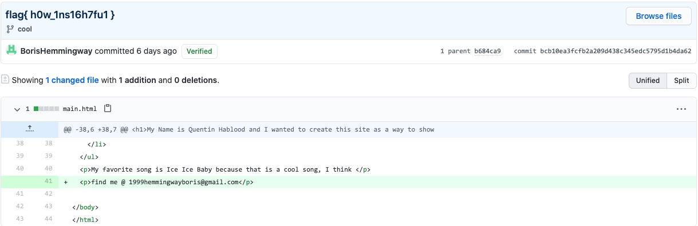

# Fish Fish Fall in <3

### Basic Info

What is their email and what is a phishing attack?

#### Hint:
> What is their email and what is a phishing attack?

### The Breakdown

Like all the other time traveling shenanigans, we just have to look at the branch named "cool" to find his email.

Coincidentally the commit was flag{ h0w_1ns16h7fu1 }

Now that you know the email 1999hemmingwayboris@gmail.com you just send over a nice phishing attack like so

### Solution
Tamaki Suoh