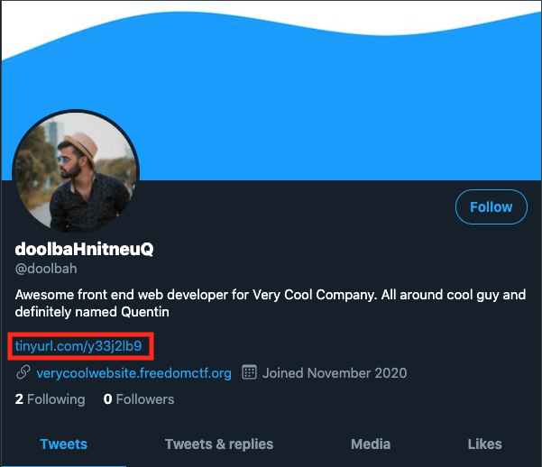
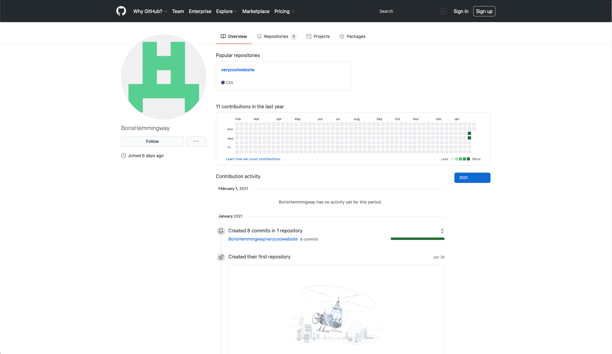

# Secret Identity

### Basic Info
What is the real name of the developer?

*not in flag format*

### The Breakdown

There is much more that the Twitter profile can tell us

Especially this thing

Clicking on it brings us to this page:

Since Boris Hemmingway != doolbaHnitneuQ

We assume that we found him ;)

### Solution
> Boris Hemmingway