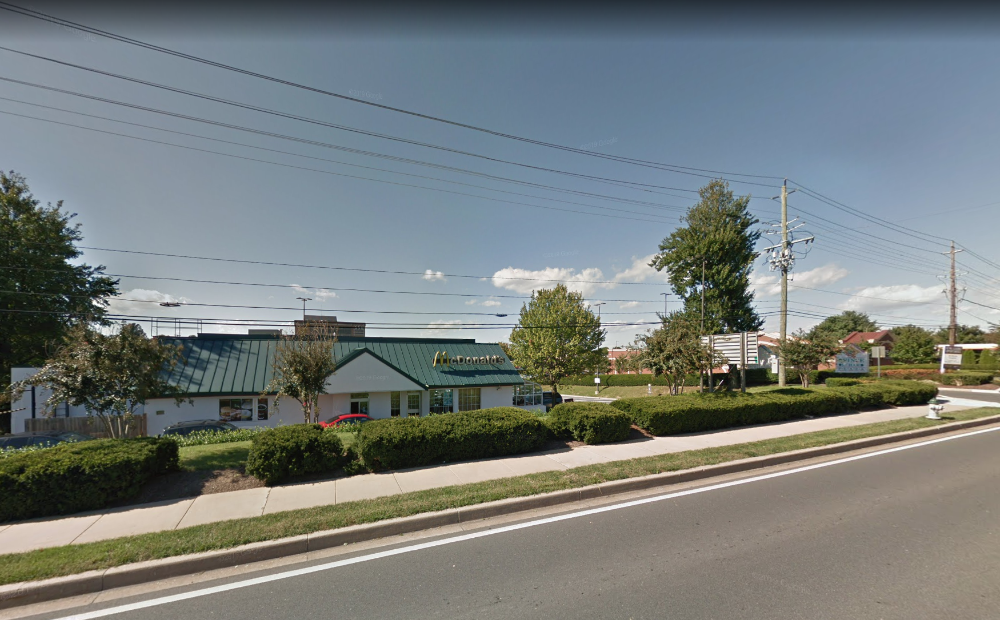
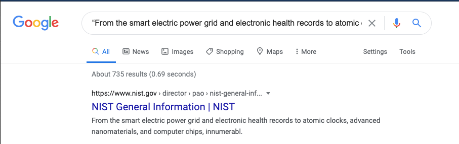
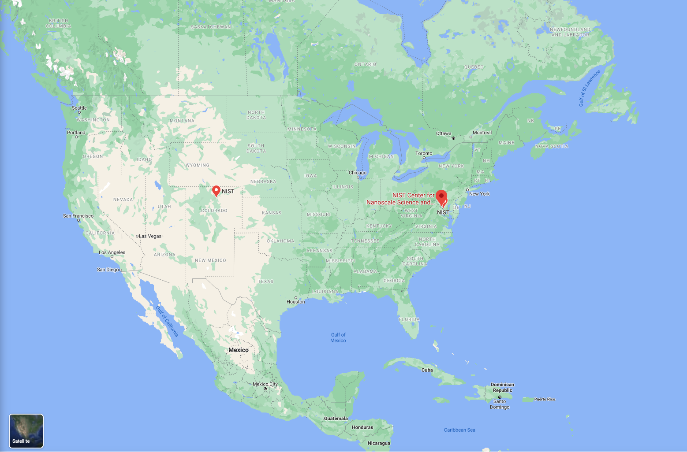
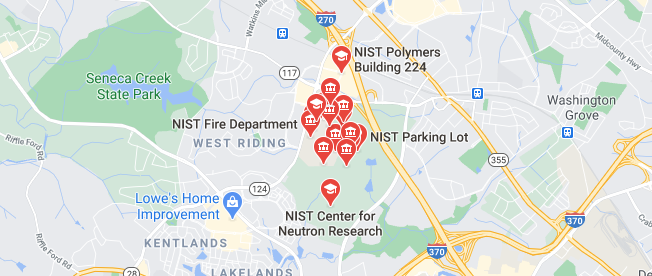
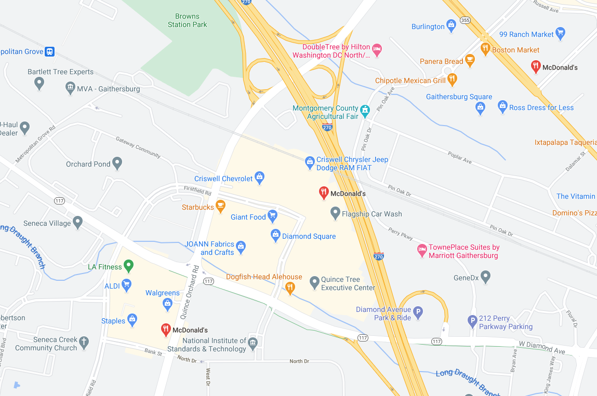
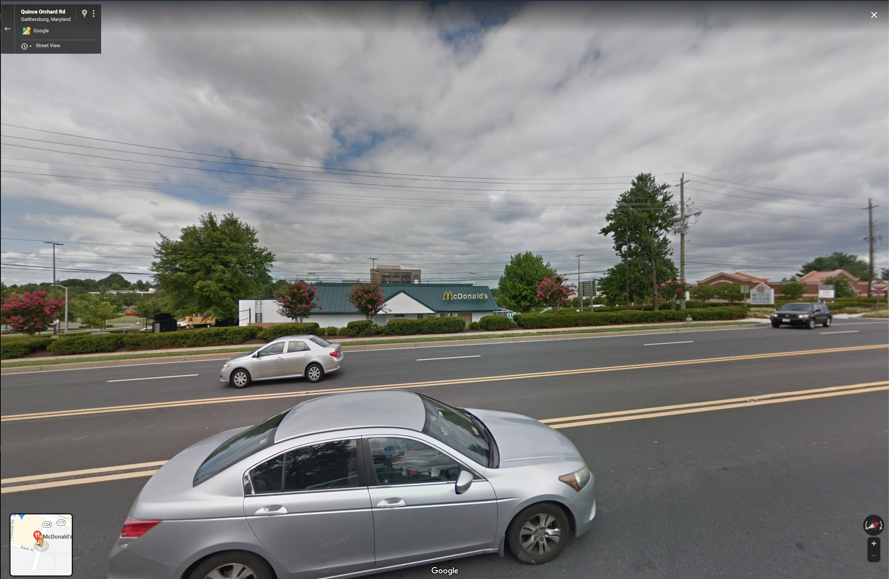

# Where in the World?

### Basic Info
Where is the developer going out to dine? Give me the location 

*Not in flag format*

#### Hint
> Close to this “From the smart electric power grid and electronic health records to atomic clocks, advanced nanomaterials, and computer chips, innumerable products and services rely in some way on technology, measurement, and standards provided”

### The Breakdown

Here is the image in question:

We can try to find this location using 2 different methods:

a ) Enhance the image to see the little shopping center plaza board over yonder

or 

b ) Use the hint

I am going to use the hint for this because it is more pragmatic and I dont want to print my face into my computer screen.

So, all you have to do is Google the phrase *“From the smart electric power grid and electronic health records to atomic clocks, advanced nanomaterials, and computer chips, innumerable products and services rely in some way on technology, measurement, and standards provided”*

And you are greeted with this:

Odd why is there NIST information for a McDonalds?

Well one Google Map search for NIST and you get a few locations

Since the link gave us the .gov website we might as well go there first which is in Maryland

Just for kicks we search for McDonalds and zoom in a bit

Now that we've narrowed it down to three places and all we have to do it check the StreetView to find the right one

Bingo!

### Solution

666 Quince Orchard Rd, Gaithersburg, MD 20878